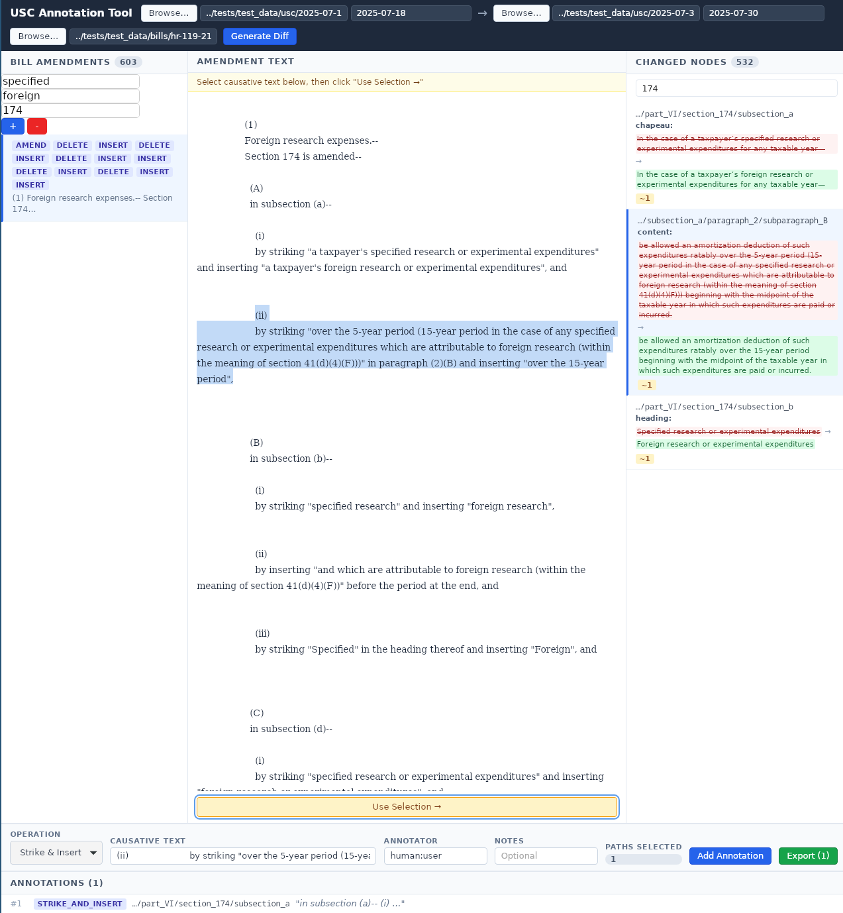

# USC Annotation Tool (ALPHA)
> **WARNING**: This tool is early alpha and is likely to be heavily refactored with upcoming changes. I've added it now so I have something tactile to try using the words-to-data library



A manual annotation prototype for generating training datasets for LLMs.

This Tauri desktop application allows annotators to link bill amendment text to corresponding changes in the US Code. The resulting annotations create structured data mapping legislative language to code modifications.

## Usage

1. Load an old and new USC XML file (with dates)
2. Load a bill XML file
3. Select an amendment from the left panel
4. Highlight the causative text in the center panel
5. Select affected nodes in the right panel
6. Add the annotation

Export annotations as JSON for use in LLM training pipelines.

## Development

```bash
cargo install tauri-cli --version "^2.0.0" --locked
cd annotator
cargo tauri dev
```

## Structure

- `src/` - Tauri backend (Rust)
- `ui/` - Svelte frontend
